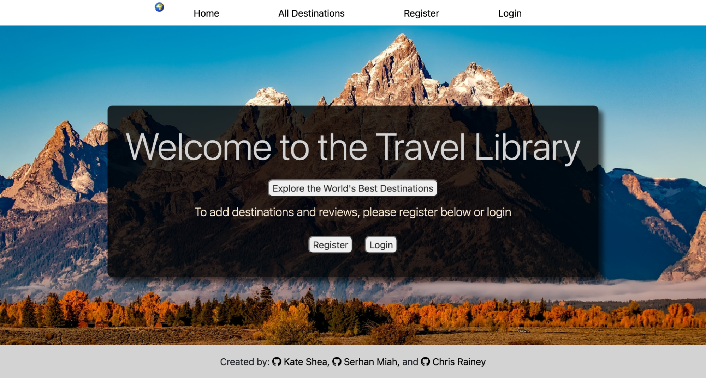

# Project 3 - Travel Library 


## Project Overview

A ten-day, group project where we used JavaScript, NodeJS, React, MongoDB, Express, Mongoose, Axios, CLI, SCSS, Insomnia, Cloudinary and AWS S3. To make an API that connects to the frontend and has CRUD functionality. We all shared our parts in making a travel review website. I worked on the API and Mongoose model and connection, styling, Cloudinary, Bootstrap and refactoring code so it can work on mobile devices. 


## Deployment

You will find the completed project here: https://sei65-destinations.netlify.app/

Please feel free to log in using the following credentials:
email: user
password: 1234

## Code Installation:

Clone or download the repo then in your Terminal run the following commands:

* Install dependencies npm i
* Start the database mongodb npm run seedDb
* Start the backend server using nodemon npm start
* Change into frontend folder cd frontend
* Run the frontend npm run start



## The Brief

* Build a full-stack application by making your backend and your frontend
* Use an Express API to serve your data from a Mongo databas
* Consume your API with a separate frontend built with React
* Be a complete product which most likely means multiple relationships and CRUD functionality for at least a couple of models
* Implement thoughtful user stories/wireframes that are significant enough to help you know which features are core MVP and which you can cut
* Be deployed online so it's publicly accessible.

## Technologies used:

### Front end:
* React
* SCSS
* Axios
* Nodemon
* React Router Dom
* React Responsive Carousel

### Back end:
* Node.js
* MongoDB
* Express
* Bcrypt
* Mongoose
* Jsonwebtoken
* AWS
* Cloudinary

### Dev Tools:
* VS code
* NPM
* Insomnia
* Git
* GitHub
* Google Chrome dev tools
* Excalidraw (Wireframing)
* Heroku (deployment)
* Google Drive -Share Folder (Images, files and documents)
* Excalidraw (Wireframing)
* Netlify (deployment)

## TThe Approach Taken: 

### Day 1 - Planning

The first step, after deciding the nature of the app and getting our initial ideas down on paper, was to work on the routes, models and controllers we would need to make sure the app would function how we planned. We started with the destination model and the user model and then added the review model. After this, we created a basic wireframe for the look of each page and how the users will navigate through the app.

Wireframe: 


We then put together a plan and drew up our MVP and goals as to how we would divide the work between the three of us, using Zoom and Slack with google drive to keep on top of things throughout the project. Because we all wanted to have a hand in creating both the backend and frontend. For the backend, I worked on the Mongoose database, seeding data and middleware.

At the very start of the project, we agreed as a group that we would run a daily morning stand-up to discuss any issues we were having. As this was our first experience of using GitHub on a group project, we decided that for the initial few days we would do pushes and pulls all together as a group, at the start of each day. This was to avoid and fix any potential merging conflicts that we would encounter. It was also useful to deal with any issues while we were working overnight. We communicated throughout each day using Slack, Zoom and google meetup after class since one of my colleagues was doing the course in a different time zone. This way we could all communicate and have a better idea of what each of us was doing and what needed to be done. 


### Day 2 - Backend and Starting the frontend


By using Zoom, Slack and google meetup, we were able to communicate with our team. We planned what each of us should be doing using Trello and who should be doing it. For the second day, I worked on partly connecting to the mongoose database. I also made the middleware, routes and controllers. We did have some issues dealing with merge conflicts at the beginning of each day, as we all wanted to work on the API at the same time and it did take a vast majority of the day to sort out these conflicts. This wasn’t ideal and it limited how much work we wanted to complete in a day. We decided on Zoom that we should assign and limit tasks on Trello. So I did the seeding data and helped construct some of the models for it. Our primary aim for day 2 was to get the majority of the API completed and ready to deploy on Heroku.
 
As the team, we all decided that it might be wise to deploy it at the end of day two using Heroku, as we might have problems closer to the deadline. We were successful in deploying the API, one of the biggest hurdles was completed and we are now able to focus on the frontend and slowly update the API when needed.
 
Our secondary aim was to ensure all of the end-points were working properly which were tested with Insomnia. Both to make sure the backend was receiving the correct authorisations and sending the correct responses with the various HTTP methods. This was done with the combination of insomnia and using the local host.
 
We spent the majority of our time collecting the data for the travel hub inputting the relevant data and using google drive to share images, documentation and other documentation such as env information and the secret word for JSON Web Token.


## Day 3 - 7 - Frontend

### Day 3

On the 3rd Day: 
We went back to Trello and Zoom to discuss the next part of our project. As a Team, we spent some time with daily standups and sorting out any potential merge conflicts in the morning. We decided to focus on the frontend. Using the wireframe as a guide we started blocking in the essential requirements for the frontend. Topics we discussed were the opening page and how would the user navigate from one page to another. We also wanted to discuss how the layout would look and I suggested following the wireframe and implementing any changes if need be.
 
After our discussion, I started on the landing, destination and single destination pages. Using Axios we were able to test the API locally and using various JavaScript map and filter methods we were able to display the images and the description on the frontend. I also worked partly on the CSS and bootstrap as styling was an important part of the project. I asked the team if we could use temporary images to block out the frontend and by using the React-Bootstrap Card which provides a flexible and extensible content container with many variants and options, these include images. Giving us a solid framework to work on. 


### Day 4

On the 4th Day:

On the 4th day, we discussed the next part of the project. Kate worked more on the backend and started using AWS S3 to host the images. We got rid of any temporary images and started to use the hosted images in the backend.
 
Since we made significant changes, we discussed as a team on Zoom about git pushing and pulling. We hoped to avoid any serious merge conflicts. After we pulled the database, we re-seed the database and were able to view all the hosted images on the frontend.
 

### Day 5 - Register, login and authorization

On the 5th day was the user interface, having the user log in, register and log out was one of the core requirements. Again, we spent our time chatting on Zoom and delegating tasks on Trello. We discussed issues we were having and how to resolve them as a team. We started each day with git pull and dealt with any merge conflicts if there were any. After discussing with the team I wanted to work on the user interface. This was one of the biggest components of the project. Our primary goal was to make a user who can register, log in and log out.
 
By using insomnia, I could see if the register and login endpoints were working and if it was producing a JSON Web Token (JWT). This was to identify the user. I created an environment variable to hold the SECRET-WORD to decrypt the token. By creating a new file called auth in the frontend. I needed to store the token in local storage, get the token, split the token and then decrypt the token. After this, we were able to identify the user and check if the user is valid.

### Day 6 - Register, login and authorization

On the 6th day:

With the registration, login and authorisation completed, we went back to Zoom and Trello. I updated the Team on my progress and moved to the review segment (I wanted peer feedback). I created a new component called ‘review’ and this was a review form for the individual destination. I created an Axios request which links to the database. I used Hooks to hold the review and setReview as an empty string. Then I created a handle submit event which holds Axios post requests. Inside the function, it will hold the headers and the authorization of the user’s token. 

I then matched the API request with the destination ID. I used useParams which returns an object of key/value pairs of the dynamic params from the current URL that was matched by the route path. This was done by routing it through the App.js file.


### Day 7 - Register, login and authorization

On the 7th day, the last part is to get the profile image working. I used Cloudinary for this part, which enables users to upload, store, manage, manipulate, and deliver images and videos for websites and apps. I made a function so that the user could upload their image to Cloudinary. By setting a default profile image the user will be able to upload a new image using Hooks by replacing the uploaded image with the image stored in the cloudinary account. 


## Travel Library Pages AllDestination, Single page and adding review images

For Travel Library there was a lot more complexity to each page. We wanted to add new features to the app including user registration, login and the ability to update the user profile. We also wanted the user to add their own destination and review each destination. I spent my time adding the image gallery and ensuring that each destination was clickable when the user selects a destination. I also focused on individual pages where the user could write a review. 


All Destionation in the frontend


The MVP for this project was completed by the end of day 7. On day 8, we wanted to make the front end to be more appealing. All of us wanted to contribute to the frontend. I started working on the individual destination page by using a react-bootstrap. After getting feedback from my team. I used the Card bootstrap called kitchen sink which gave a more grided approach to how information was displayed. I kept the design simple and stuck to the wireframe when making any design choices.
 
Once the design was done, I started to work on the review component. I wanted the user to upload their image when making a review. I again used Cloudinary to upload an image. I created a function called upload images which triggers an event. The main feature of Cloudinary was for the user to store the image and return an image URL.

Code Snippet on the review 


How Cloudinary is store


Front end review page


## Travel Library - React Form Pages

The profile page, edit profile page, review and edit the review - all the pages that were made with React component Form and with a few additional features of Cloudinary cloud server. Refactoring each element for our project. Since most of our functionality was using a Form an input, I spent the last few days making sure it would support the react framework and provide a sleek design ready for mobile devices.


Front end review Form 


## Day 9 & 10 - Styling tweaks with my teammates

Days 8 & 9 were spent mostly on styling and adding the correct fonts, background and the whole feel of the website. Chris and I worked closely to ensure that all the pages looked slick and more pleasing to the eyes. I spent time refactoring the code to support react and by supporting react making it workable on mobile devices. Chris added the React Responsive Carousel, which is a plugin to add multiple carousel images, shown on individual pages, while I try to refactor some of the codes. 


## Deployment - Heroku & Netifily 

After we deployed the API we found it was easier with Heroku. We linked it up, tested it, and then deployed it. Throughout the project, we linked the frontend to the backend and tested locally, and once we were happy with this we deployed through Heroku and Netifily.


## Final Product 

Home Page


Travel Library Index Page:


Travel Library INDIVIDUAL PAGE:


Travel Library Register Page and Login Page:


Profile page:


Travel Library Add Destination and add Review:

Add destination 


Add Review


```Javascript
    // AXIOS GET REQUEST
  useEffect(() => {

      const getData = async () => {
        try {
          const { data } = await axios.get('https://the-trivia-api.com/api/questions')
          // console.log(data)
          setTestData(data)
          // ! this will be the entire API library
        } catch (error) {
          console.log(error)
        }
      }
      getData()
    }, [visibleQuestion])
```


## Wins & Challenges

### Win
* A big win for me personally was that we created a very slick website which has a responsive design. I managed to add all of the features we had originally planned for the travel journey section of the site. 


### Challenges
* One of my aims was to get MapBox installed on the website. Unfortunately, we weren't able to get it running due to time constraints and problems with merge conflicts at the start of the project. I do hope to address this in the future version when we get the time to look over projects.


### Bugs
* Some of the styling, especially on the user-profile page wasn’t the same. I hope to address this. 
* We weren't able to upload multiple images. So if the user wants to write a review about a destination the user can only upload one image at a time.  


## Future Content and Improvements:

* Some of the styling, especially on the user-profile page wasn’t the same. I hope to address this. .
* We weren't able to upload multiple images. So if the user wants to write a review about a destination the user can only upload one image at a time. 
* Hope to address the React Card in the review of each section - The design of it wasn’t functional and will not work properly on smaller devices.


## Key learnings
Working in a small group on this project has helped me learn a lot about how I communicate with my teammates and just how important it is to keep talking, especially early on in our project.
It was a great way to communicate what part I was working on and so it helped further in the project. As we were able to reduce merge conflicts to a minimum but had a fair bit of trouble with git conflicts at the beginning. I feel more confident about how to deal with git conflicts and working in a team. Also to play to our strengths and weaknesses and not be afraid to ask for help. Especially working in a team where everyone has their strength. 
